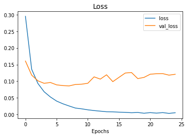
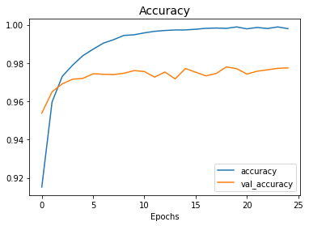

## Mnist Handwriting

It is the implementation in MLP(Multi Layer Perceptron) basically ANN.

The dataset is loaded from keras itself.

It uses some function like `Flatten`. It is to convert 2D data of array of image to 1D.

Matplotllib function `imshow()` is used to see the numbers image 

History is stored to render in plot.

### Loss plot during model fit

### Accuracy plot during model fit
